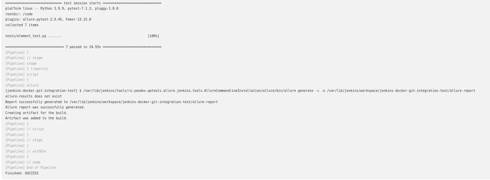

# Running Tests

### Via PyCharm
- Confirm that PyCharm has been configured correctly: project interpreter and environment variables
- Navigate to the `./tests/element_test` file and use the PyCharm UI to run the test
It should pass first time.


### Via Docker

To run the tests inside a container using the image [built here](../../README.md#docker):

```shell
docker run  {the name of the assembled container} pytest 
```
You can specify the flag ``--alluredir='${WORKSPACE}/allure-results'``  to generate a folder with allure-reports.
After that, write a command ``allure serve ./allure-results`` to display the report in the browser window.

###Via Jenkins
First part of installation guide concerns global installation of Allure plugin and it’s commandline tool.

- Install the latest version of Allure Plugin from "Plugin Manager" page.
- Open Plugin Advanced Settings (at <your_jenkins_host>/pluginManager/advanced).
- Click "Check Updates" button on the bottom right corner of the page.
- Configure Allure Commandline from "Global Tools Configuration".
- Open "Global Tool Configuration".
- Find "Allure Commandline" configuration block.
- Click "Add Allure Commandline" button.
- Fill the name and choose the version in the "From Maven Central" dropdown.

After then: 
- Copy the HTTPS path to this repository.
- Open Jenkins in your local machine.
- Create a new Job.
- Choose type job: `Pipeline`
- In the page that opens, click tab `Pipeline`
- Expand the drop-down list: `SCM` and choose `GIT`
- Configure the settings according to the repository that we copied and click button `save`
- On the job page click of the link `Build now`

After we can go to the `Console Output` page and make sure that everything went well.
If necessary, view `Allure report`

### Expected successful Console Output in Jenkins


